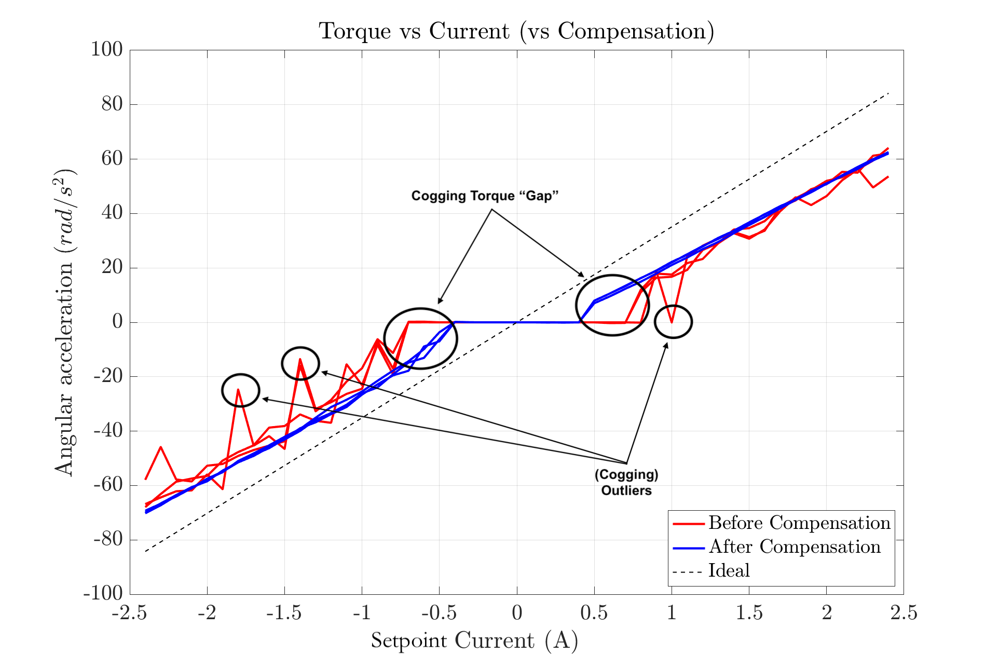

# Notes

Please see `cogging_characterization.py` for implementation details.

* [Cogging map](#cogging-map)
* [Acceleration tests](#acceleration-tests)
* [Slow Tests](#slow-tests)
* [Pull tests](#pull-tests)

## Cogging map
coggingmap_0 was measured on axis 0 

*naming convention*: `cogging_measure_final_{trial}_{counts}.npy`, where `counts` is how many counts were skipped between measurements (ie go to position 0, 16, 32, ... for counts=16).  `counts` has an 'r' at the end if it was the reverse direction 

### Description of experiments
* *a* - first measurements with increasingly fine measurements.  Qualitatively, going finer than once per 16 counts
* *b* - didn't change anything, just ran again to see repeatability - very repeatable
* *c* - rebooted odrive, this time the cogging map was off by 1/2 revolution (4096 ticks)
* *d* - re"index search" on both axes with*out* rebooting odrive
* *e* - next day, measured cogging in reverse

### Results/Conclusions

The first gif shows the cogging maps from a-d, with c being adjusted by 180 degrees.  The second also shows e (the reversed one) and evidences some dc bias/friction.  Nevertheless, they're all very consistent.

Also, I later [(Slow tests)](#slow-tests) figured out why sometimes the cogging map is "randomly" 180 degrees off.  It's because of the other motor **crosstalk**.  See discussion in [Slow tests](#resultsconclusions-2)

## Acceleration tests
spinup the motor with set current and observe acceleration.  Trials are back-to-back so the motor experiences deceleration then acceleration for most measurement points.

### description
tests 0-2 are unloaded and uncompensated, but not very high quality.  Unloaded motor has moment of inertia ~0.00025[kg.m^2].  Tests 3-8 are better quality, measured from 0A-2.5A measured every 0.1A.  3 trials with compensation and 3 trials without.

### Results/Conclusions

The plot shows two key aspects of the motion.  
1. **Outliers** - Non-compensated motion results in a lot of (low acceleration) outliers which indicates the motor was likely *randomly* unable to start due to cogging, which is very bad and hard to control.  In contrast, *with* anti-cogging compensation, the acceleration vs current is remarkably predictable, with the 3 trials hardly differing from eachother at all.
2. **Cogging Torque "Gap"** - The cogging torque is most significant at slow speeds.  We see this gap in the graph where, for non-compensated motion, we do not see torque until ~0.75A whereas we expect to see torque beginning around 0.3A if "kinetic and static friction are the same".  After applying compensation, we see that the torque begins much closer to what we expect.  From this graph, we can actually estimate the cogging torque to be roughly the torque in the compensated motion when the uncompensated motion finally begins, which is around 15 rad/s^2 <=> **0.4A** <=> 3N.mm

## Slow tests
Spin the motor slowly and see how much oscillation (position error) there is **with and without anti-cogging compensation**.

### Description
* slow_goodgains - command **position setpoints**.  first set of tests with correct (unloaded motor) gains.  setpoint 0.1 rev/s.  
    **edit actually the position gain was way too high, I forgot.  It was set at 100 instead of ~45
* slow_goodgains_2 - I don't think I changed anything
* slow2 - command **velocity** instead of position setpoints. setpoint 0.1 rev/s
* slow2_slower - move slower.  setpoint 0.03 rev/s

### Results/Conclusions

Anti-cogging totally helps and I think it's sufficient for my needs.

Videos on my phone/spring2020 meeting slides corroborate as well.

Also, **cogging maps are 100% dependent upon adjacent motors and iron.**  It is so obvious when you turn compensation on, set current to 0, and then spin the motors with your hands.  There is one particular location of the passive motor (axis 1) that the cogging map for axis 0 was measured at and you can feel that as soon as axis 1 snaps into that position, axis 0 can spin freely.  At other locations, axis 0 cogs even more than without anti-cogging compensation.

## Pull tests
Let one motor be passive (0A current control) and tie string to another motor (active) which is pulling.  Measure position and current of the active motor.  All data in folder [pull_tests](./pull_tests).

### Descriptions

| filename | passive motor compensation | active motor compensation | speed (rev/s) |
| --- | --- | --- | --- |
| `comp_fast` | ON | OFF | 10 |
| `comp_slow` | ON | OFF | 1 |
| `uncomp_fast` | OFF | OFF | 10 |
| `uncomp_slow` | OFF | OFF | 1 |

### Results / Conclusions

In the left plots (slow motion), notice the peaks both the vel and current waveforms.  These peaks are the cogs which screw up torque control, which are improved by a factor of about 2 for current using anticogging compensation on the passive motor only.  On the right side (fast motion), we see that the spikes are less significant for both w/ and w/o compensation which is exactly what we predict since rotor inertia smooths out the torque ripples.

Note that I haven't yet collected data where both passive and active motors are using anti-cogging compensation, but I would expect the current spikes to get even smaller in this case.